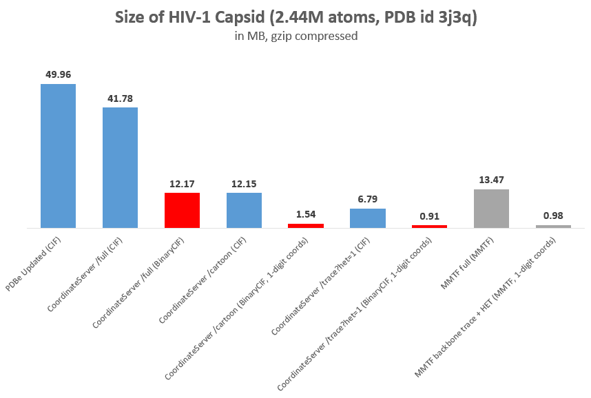
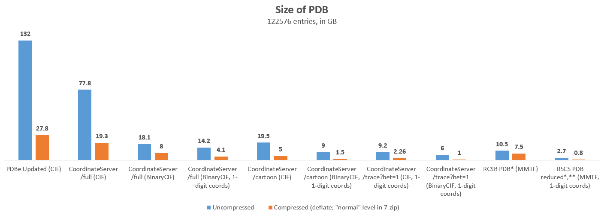
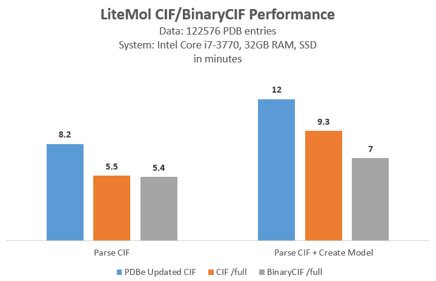

What is BinaryCIF
=================

BinaryCIF is a data format that stores text based CIF files using 
a more efficient binary encoding. It enables both lossless and lossy
compression of the original CIF file.

The BinaryCIF format support is implemented as part of the [CIFTools.js library](https://github.com/dsehnal/CIFTools.js).
The format is also used by the [CoordinateServer](https://webchemdev.ncbr.muni.cz/CoordinateServer) service to encode macromolecular data.

Some aspects of the BinaryCIF format, namely using [MessagePack](https://msgpack.org/) as the container
and the usage the fixed point, run length, delta, and integer packing encodings was
inspired by the [MMTF data format](http://mmtf.rcsb.org).

Table of contents
=================

* [Basic Principles](#basic-principles)
* [BinaryCIF Format](#binarycif-format)
    - [Data Layout](#data-layout)
    - [Encoding Methods](#encoding-methods)
    - [Encoding Process](#encoding-process)
    - [Decoding Process](#decoding-process)
    - [Reference Implementation](#reference-implementation)
* [Use Cases](#use-cases)
    - [CoordinateServer](#coordinateserver)
* [Benchmark](#benchmark)
    - [HIV-1 Capsid size](#hiv-1-capsid-size)
    - [Whole PDB archive size](#whole-pdb-archive-size)
    - [Read and write performance](#read-and-write-performance)

Basic Principles
================

In this chapter the basic ideas behind the BinaryCIF will are discussed. 

[CIF](http://www.iucr.org/resources/cif/spec/version1.1/cifsyntax) is a text based format for storing tabular data. 
The data is stored row by row using this syntax:

```
loop_
_category.field1
_category.field2
...
_category.fieldK
value-1_1 value-1_2 ... value-1_K
...
value-N_1 value-N_2 ... value-N_K
```

For example, the table called ``atoms`` with columns ``type, id, element, x, y, z``

|type|id|element|x|y|z|
|:---:|---:|:---:|---:|---:|---:|
|ATOM|1|C|0|0|0|
|ATOM|2|C|1|0|0|
|ATOM|3|O|0|1|0|
|HETATM|4|Fe|0|0|1|

would be stored in CIF as 

```
loop_
_atoms.type
_atoms.id
_atoms.element
_atoms.x
_atoms.y
_atoms.z
ATOM 1 C 0 0 0
ATOM 2 C 1 0 0
ATOM 3 O 0 1 0
HETATM 4 Fe 0 0 1
```

If we want to compress the rows using a dictionary compression, it would identify 
the string ATOM as a repeated substring and represent the rows something along the lines of

```
A = ATOM

{A} 1 C 0 0 0
{A} 2 C 1 0 0
{A} 3 O 0 1 0
HETATM 4 Fe 0 0 1 
```

where ``{A}`` is a dictionary reference to the string ``ATOM``. At first, it would seem 
that this is an efficient solution. However, the problem with this data representation is that 
it is actually hard to compress because related data is not next to each other. 

Fortunately, we can do much better than this: we can transpose the tabular data 
and store them *per column* instead of *per row*:

```
_atoms.type:    ATOM ATOM ATOM HETATM
_atoms.id:      1 2 3 4
_atoms.element: C C O Fe
_atoms.x        0 1 0 0
_atoms.y        0 0 1 0
_atoms.z        0 0 0 1
```

Now, we can compress all the repeating ATOM values using a method called run-length encoding:

```
_atoms.type: {ATOM, 3} HETATM
```

Where ``{ATOM, 3}`` means *repeat the string* ``ATOM`` *3 times*. If the value ATOM repeats 
1 million times (which is quite common), this approach saves us a lot of space.

Similarly, we can apply different encoding schemes to other types of data. 
For example, the sequence

```
1 2 3 4 5 ... n
``` 

can be encoded using delta encoding as 

```
1 1 1 1 1 ...
```

meaning we start with 1, then add 1 to the previous value, ending up with 2, then add 1 to the
previous values as well getting 3, etc. At this point, we can use the run-length encoding
approach from the ATOM example and end up with 

```
{1, n}
```

to represent the original sequence of integers from 1 to n.

The final step is to use binary instead of text encoding to store our data to make it more 
space efficient. For example, storing the number 1234 as text requires 4 bytes:

```
"1"  "2"  "3"  "4"

0x31 0x32 0x33 0x34
```

However, storing the number as a 16-bit integer, we required only 2 bytes:

```
4 * 256  +   210 

  0x04      0xD2
```

Applying the different encoding methods, the representation of our ``atoms`` table becomes

```
_atoms.type:    {ATOM, 3} HETATM
_atoms.id:      {1, 4}
_atoms.element: {C, 2} O Fe
_atoms.x        0x00 0x01 0x00 0x00
_atoms.y        0x00 0x00 0x01 0x00
_atoms.z        0x00 0x00 0x00 0x01 
```

BinaryCIF Format
================

## Data Layout

A [CIF file](http://www.iucr.org/resources/cif/spec/version1.1/cifsyntax) ([example](https://www.ebi.ac.uk/pdbe/static/entry/1tqn_updated.cif)) contains:

* One or more data blocks
* Each data block has one or more category
* Each category has one or more field
* Each field contains *data*

To represent this hierarchy, the basic shape of the BinaryCIF file defines the following 
interfaces:

```
File {
    version: string
    encoder: string
    dataBlocks: DataBlock[]
}

DataBlock {
    header: string
    categories: Category[]
}

Category {
    name: string
    rowCount: number
    columns: Column[]
}

Column {
    name: string
    data: Data
    mask: Data
}

Data {
    data: Uint8Array
    encoding: Encoding[]
}
```

The most interesting part is the ``Data`` interface where the actual data is stored. 
The interface has two properties: ``data`` which is just an array of bytes (the binary data) 
and an array of *encodings* that describes the transformations that were applied to the 
source data to obtain the final binary result stored in the ``data`` field.

Additionally, the ``Column`` interface defines a ``mask`` property used to determine
if a certain value is present, not present (``.`` token in CIF), or unknown (``?`` token in CIF). 

Currently, BinaryCIF supports these encoding methods:

```
type Encoding = 
    | ByteArray 
    | FixedPoint
    | IntervalQuantization 
    | RunLength 
    | Delta 
    | IntegerPacking 
    | StringArray
``` 

## Encoding Methods

### Byte Array

Encodes an array of numbers of specified types as raw bytes.

```
ByteArray {
    kind = "ByteArray"
    type: Int8 | Int16 | Int32 | Uint8 | Uint16 | Uint32 | Float32 | Float64
}
```

### Fixed Point

Converts an array of floating point numbers to an array of 32-bit integers multiplied 
by a given factor. 

```
FixedPoint {
    kind = "FixedPoint"
    factor: number
    srcType: Float32 | Float64
}
```

#### Example

```
[1.2, 1.23, 0.123] 
---FixedPoint---> 
{ factor = 100 } [120, 123, 12] 
``` 

### Interval Quantization

Converts an array of floating point numbers to an array of 32-bit integers where 
the values are quantized within a given interval into specified number of
discrete steps. Values lower than the minimum value or greater than the 
maximum are reprented by the respective boundary values.

```
FixedPoint {
    kind = "IntervalQuantization"
    min: number,
    max: number,
    numSteps: number,
    srcType: Float32 | Float64
}
```

#### Example

```
[0.5, 1, 1.5, 2, 3, 1.345 ] 
---IntervalQuantization---> 
{ min = 1, max = 2, numSteps = 3 } [0, 0, 1, 2, 2, 1] 
``` 

### Run Length

Represents each integer value in the input as a pair of ``(value, number of repeats)``
and stores the result sequentially as an array of 32-bit integers. Additionally,
stores the size of the original array to make decoding easier.

```
RunLength {
    kind = "RunLength"
    srcType: int[]
    srcSize: number
}
```

#### Example

```
[1, 1, 1, 2, 3, 3] 
---RunLength---> 
{ srcSize = 6 } [1, 3, 2, 1, 3, 2]
```

### Delta

Stores the input integer array as an array of consecutive differences. 

```
Delta {
    kind = "Delta"
    origin: number
    srcType: int[]
}
```

Because delta encoding is often used in conjuction with integer packing,
the ``origin`` property is present. This is to optimize the case
where the first value is large, but the differences are small. 

#### Example

```
[1000, 1003, 1005, 1006] 
---Delta---> 
{ origin = 1000, srcType = Int32 } [0, 2, 2, 1]
```

### Integer Packing

Stores a 32-bit integer array using 8- or 16-bit values. Includes the size 
of the input array for easier decoding. The encoding is more effective 
when only unsigned values are privided. 

```
IntegerPacking {
    kind = "IntegerPacking"
    byteCount: number
    srcSize: number
    isUnsigned: boolean
}
```

#### Example 

```
[1, 2, -3, 128] 
---IntgerPacking---> 
{ byteCount = 1, srcSize = 4, isUnsigned = false } [1, 2, -3, 127, 1]
```

### String Array

Stores an array of strings as a concatenation of all unique strings, an array of offsets
describing substrings, and indices into the offset array. 
indices to corresponding substrings.

```
StringArray {
    kind = "StringArray"
    dataEncoding: Encoding[]
    stringData: string
    offsetEncoding: Encoding[]
    offsets: Uint8Array
}
```

#### Example

```
['a','AB','a'] 
---StringArray---> 
{ stringData = 'aAB', offsets = [0, 1, 3] } [0, 1, 0]
```

Encoding Process
----------------

To encode the data, a sequence of encoding transformations needs to be specified
for each input column. For example, to encode the ``_atoms.id`` column
from the background section, we could specify the encoding as ``[Delta, RunLength, IntegerPacking]``:

```
[1, 2, 3, 4]
---Delta--->
{ srcType = Int32 } [1, 1, 1, 1]
---RunLength--->
{ srcSize = 4 } [1, 4]
---IntegerPacking--->
{ byteCount = 1, srcSize = 2 } [1, 4]
```

Once each column has been encoded and the ``File`` data structure built, the 
[MessagePack](https://msgpack.org/) format (which is more or less a binary encoding of the standard
JSON format) is used to produce the final binary result. 

Optionally, the data can be compressed using standard methods such as Gzip to achieve
further compression.

Decoding Process
----------------

To decode the BinaryCIF data, first the MessagePack data are decoded and then 
for each column, the binary data are decoded applying inverses of the transformations
specified in the ``encoding`` array backwards. So to decode the encoding specified by
``[Delta, RunLength, IntegerPacking]`` we would first apply the decoding
of ``IntegerPacking``, then ``RunLength``, and finally ``Delta``.

Reference Implementation
------------------------

The BinaryCIF format is implemented in the [CIFTools.js library](https://github.com/dsehnal/CIFTools.js).

Specific useful parts of the code:

- [Data Layout and Encoding Methods Interfaces](https://github.com/dsehnal/CIFTools.js/blob/master/src/Binary/Encoding.ts)
- [CIF Dictionary Interfaces](https://github.com/dsehnal/CIFTools.js/blob/master/src/Dictionary.ts)
    - [BinaryCIF implementation of the Interfaces](https://github.com/dsehnal/CIFTools.js/blob/master/src/Binary/Dictionary.ts)

All the important code can be found in [this folder](https://github.com/dsehnal/CIFTools.js/tree/master/src/Binary). Be sure to check out
the [examples](https://github.com/dsehnal/CIFTools.js/tree/master/examples).

Use Cases
=========

## CoordinateServer

BinaryCIF is supported by the [CoordinateServer](https://webchemdev.ncbr.muni.cz/CoordinateServer), a web service for 
delivering subsets of 3D macromolecular data stored in the [mmCIF format](http://mmcif.wwpdb.org/).

The server can return data both in the text and binary version of the CIF format,
with the binary representation being a lot more efficient (see the [benchmark](#benchmark)).

Benchmark
=========

The BinaryCIF format has been applied to encode macromolecular data stored using [mmCIF](http://mmcif.wwpdb.org/) 
data format (mmCIF is a schema of categories and fields that desribe a macromolecular structure
stored using the CIF format). The raw data for the benchmark are included in this repository.

- The "CoordinateServer" results were obtained using the corresponding query of the [CoordinateServer](https://webchemdev.ncbr.muni.cz/CoordinateServer).
- The "MMTF" results were obtained using [MMTF](https://mmtf.rcsb.org) version 1.0.

## HIV-1 Capsid size

Encoding the currenly largest structure in the PDB.org archive, the [HIV-1 Capsid](https://pdbe.org/3j3q)
with 2.44M atoms, BinaryCIF achieves very good results. 




## Whole PDB archive size

- (*) RCSB PDB: 122333 Entries, some 404'ed; recompressed using the same compression level as the other data.
- (**) reduced = alpha + phosphate trace + HET




## Read and write performance

This is the performance of BinaryCIF implementation of the [CIFTools.js library](https://github.com/dsehnal/CIFTools.js),
[LiteMol](https://github.com/dsehnal/LiteMol), and the [CoordinateServer](https://webchemdev.ncbr.muni.cz/CoordinateServer).




